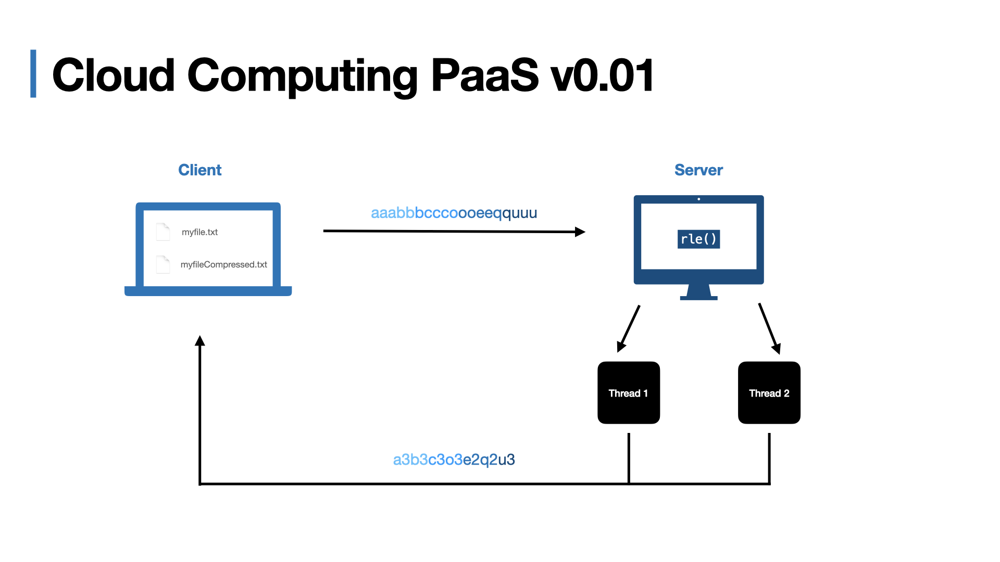

# OS Project

Given a `file.txt` that contains a string that has *n* characters, subdivide the array into 𝑚 partitions where 𝑚 is the number of cores available in the machine. Using the **RLE algorithm**, **compress** and **decompress** using **sockets** (client-server application)

### Topics touched in the project

- **Threads** and argument passing
- **Sockets**
- **Command-line** argument passing 
- **I/O**
- **Run-lenght encoding** compression and decompression

